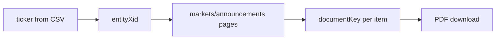

# ASX data sources

Reference URLs and API patterns for Stage 1 fetch. Full pipeline detail: [`0-work/plans/plan.md`](../plans/plan.md).

---

## Entity directory (CSV)

Live source — same format as [`ASX_Listed_Companies_*.csv`](ASX_Listed_Companies_30-06-2026_11-15-18_AEST.csv):

```
GET https://asx.api.markitdigital.com/asx-research/1.0/companies/directory/file
```

Returns: ASX code, company name, GICS industry group, listing date, market cap.

**Note:** Source directory has tickers only. Step B resolves `entity_xid` and writes it onto `data/entities.csv`.

---

## Announcements API (primary — use this, not HTML scrape)

Paginated JSON feed for all announcements for a company:

```
GET https://asx.api.markitdigital.com/asx-research/1.0/markets/announcements
    ?entityXids={entityXid}
    &page={0-based page index}
    &itemsPerPage={100}
```

Paginate until all items retrieved. No type filter in Stage 1.

### Response fields (per item)

Stored on `data/entities/{TICKER}/{TICKER}_Announcements.csv` — one column per field. Full column and tag reference: [`announcements-schema.md`](announcements-schema.md).

| Field | Type |
|-------|------|
| `documentKey` | string — CDN file id |
| `date` | ISO datetime |
| `headline` | string |
| `announcementTypes` | JSON array |
| `fileSize` | string |
| `isPriceSensitive` | boolean |
| `symbol` | string |
| `url` | string |
| `companies` | JSON array |
| `companyInfo` | JSON array (includes `xidEntity`) |
| `symbolsSecondary` | JSON array |

Plus columns `ticker` and `entity_xid` from `entities.csv`.

Top-level `data.count` = total announcements for that entity (e.g. CBA ≈ 7,700; 29M ≈ 432).

### Lightweight endpoint (recent only — not for full history)

```
GET https://asx.api.markitdigital.com/asx-research/1.0/companies/{TICKER}/announcements?count=5
```

Returns ~5 recent items plus security `xid` at `data.xid`. **Do not use** for paginated history — security `xid` ≠ `entityXid`.

---

## Two IDs you need (and where they come from)



| ID | What it is | Where you get it |
|----|------------|------------------|
| **`entity_xid`** | Company id for paginated announcements | Resolved in Step B; stored on **`data/entities.csv`** |
| **`documentKey`** | One PDF file | Every row in `data.items[]`; stored on **`entities/{TICKER}/announcements.csv`** |

Stage 1 indexes **all** announcements per entity. Filter from the announcements CSV when fetching or parsing (e.g. `--annual-reports-only` on the fetcher — see [`announcements-schema.md`](announcements-schema.md)).

Example (CBA):

- `entityXid`: `204245597`
- Annual report item: `headline: "2025 Annual Report"`, `documentKey: "2924-02977830-2A1613327"`

The `{id}` in the CDN URL **is** `documentKey`.

---

## PDF download (CDN)

**Preferred (matches browser links):**

```
GET https://cdn-api.markitdigital.com/apiman-gateway/ASX/asx-research/1.0/file/{documentKey}&v=undefined
```

**Alternative (same file, direct API host):**

```
GET https://asx.api.markitdigital.com/asx-research/1.0/file/{documentKey}
```

Sample: [2924-02943769-3A667578](https://cdn-api.markitdigital.com/apiman-gateway/ASX/asx-research/1.0/file/2924-02943769-3A667578&v=undefined)

---

## Human-readable announcements page (reference only)

Pattern: `https://www.asx.com.au/markets/trade-our-cash-market/announcements.{ticker_lower}`

The suffix is the ASX code in **lowercase** (e.g. ticker `29M` → `.29m`).

This page uses the same Markit API under the hood. Scripts should call the JSON API directly, not scrape this HTML.
