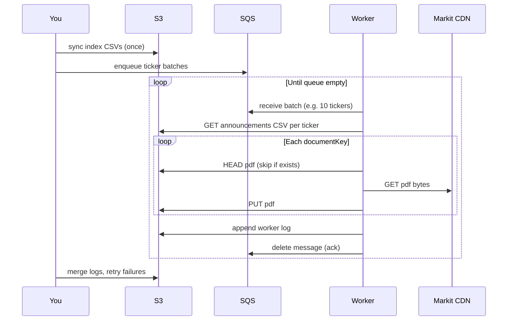

# AWS distributed fetch — Stage 2 strategy

**Status:** approved direction  
**Scope:** Download ~1.26M ASX PDFs (~500 GB–1.2 TB) to S3 using a ticker-sharded worker fleet  
**Prerequisite:** Step 2 index complete locally (`*_Announcements.csv` per ticker)

Full execution context: [`plan.md`](plan.md). This doc is the **AWS-specific** design.

---

## How it works (plain English)

You already have a **catalog** of every document to fetch: one CSV per ticker listing every `documentKey`. Stage 2 is not “scrape the web again” — it is **download each PDF from the Markit CDN and store it in S3**, skipping anything that already exists.

The job is split into three layers:

| Layer | What it does | AWS service |
|-------|----------------|-------------|
| **Storage** | Holds index CSVs + PDFs forever | **S3** |
| **Work queue** | Hands out ticker batches to workers | **SQS** |
| **Workers** | Pull a batch, download PDFs, upload to S3 | **EC2 spot** (or Fargate) |

Nothing needs inbound access (no SSH tunnels). Each worker only makes **outbound HTTPS** calls to the Markit CDN and **outbound S3 PUT/HEAD** calls. Credentials come from an **IAM instance role** attached to the EC2 — no long-lived access keys on disk.



### Why multiple VMs?

The bottleneck is **network + CDN rate limits**, not CPU. One process at 1 req/s takes ~14 days for ~1.26M files. Ten spot VMs (each with its own public IP, each throttled to ~1 req/s) can cut that to ~1.5 days — *if* the CDN rate-limits per IP. A short **soak test** (1 VM vs 4 VMs) confirms how far to scale before 429 errors appear.

### Why S3 as source of truth?

- ~1 TB does not belong on a laptop or in git.
- S3 `HeadObject` replaces local “file exists?” checks — workers stay stateless.
- Later stages (parse, analysis) read from the same bucket.

---

## S3 layout

Mirror the local `data/` tree:

```
s3://gypsy-danger-asx/          # bucket name TBD at deploy
  entities.csv
  entities/{TICKER}/{TICKER}_Announcements.csv
  entities/{TICKER}/raw/{documentKey}.pdf
  logs/fetch/{worker_id}/{run_id}.jsonl
  manifests/completed_tickers.txt
  manifests/failed_tickers.json
```

**Index upload (once, before workers):**

```bash
aws s3 cp data/entities.csv s3://$BUCKET/entities.csv
aws s3 sync data/entities/ s3://$BUCKET/entities/ \
  --exclude "*/raw/*" \
  --include "*/raw/" \
  --include "*_Announcements.csv"
```

PDF prefix stays empty until workers fill it.

---

## AWS resources (minimal stack)

| Resource | Purpose | Notes |
|----------|---------|-------|
| **S3 bucket** | Corpus storage | Block public access; SSE-S3 encryption |
| **SQS queue** | Work distribution | Standard queue; visibility timeout > worst ticker time |
| **SQS DLQ** | Failed batches | Tickers to retry manually |
| **IAM role** | Worker permissions | `s3:GetObject`, `PutObject`, `HeadObject`; `sqs:ReceiveMessage`, `DeleteMessage` |
| **EC2 launch template** | Worker image | Amazon Linux 2023, `t3.small` or `c7g.medium |
| **Auto Scaling Group** | Spot fleet | Desired capacity = worker count (start 4–10) |
| **Security group** | Egress only | Outbound 443; no inbound rules |

Optional later: CloudWatch dashboard for queue depth + worker count.

**Region:** `ap-southeast-2` (Sydney) — closest to ASX; adjust if your account prefers another region.

---

## Work unit: ticker batch

Each SQS message:

```json
{"tickers": ["CBA", "NAB", "WBC", "ANZ", "MQG", "WES", "WOW", "TLS", "BXB", "GMG"]}
```

Worker algorithm:

1. Poll SQS (long polling).
2. For each ticker in the message:
   - Load `{TICKER}_Announcements.csv` from S3.
   - For each `documentKey`:
     - `HeadObject` on `entities/{TICKER}/raw/{documentKey}.pdf` — skip if exists and size ≥ 50 KB.
     - Stream download from CDN → `PutObject` to S3.
     - Append one JSON line to local log.
   - Append ticker to `completed_tickers` manifest (S3 append or conditional write).
3. Upload worker log to S3.
4. Delete SQS message.

**Rate limit:** 1 req/s per worker (match current `AsxClient`). Back off on 429/503.

**Idempotency:** Safe to re-run any ticker or restart any worker — S3 HEAD is the guard.

---

## Execution phases

### Phase A — Bootstrap (once per account/region)

| Step | Action | Who |
|------|--------|-----|
| A1 | `aws login` (or SSO) | Human once |
| A2 | Deploy stack (CDK/Terraform or `0-work/scripts/aws/`) | Cursor agent + CLI |
| A3 | Upload index CSVs to S3 | Agent / CLI |
| A4 | Build worker AMI or user-data script | Agent |

### Phase B — Soak test (required)

| Step | Action | Success criteria |
|------|--------|------------------|
| B1 | Enqueue ~20 tickers | Messages visible in SQS |
| B2 | Run 1 worker × 2 h | Measure docs/hr, error rate |
| B3 | Run 4 workers × 2 h | Confirm near-linear scaling |
| B4 | Pick fleet size | &lt;1% failures, no sustained 429s |

### Phase C — Full fetch

| Step | Action |
|------|--------|
| C1 | Enqueue all ~1,838 tickers (skip `completed_tickers.txt`) |
| C2 | Scale ASG to chosen worker count |
| C3 | Monitor queue depth → 0 |
| C4 | Merge worker jsonl logs → `fetch_log.json` |
| C5 | Retry pass on failed `documentKey`s |

### Phase D — Cutover

Local `data/entities/*/raw/` becomes optional cache. Parse stage reads from S3.

---

## Code to add (repo)

| Artifact | Purpose |
|----------|---------|
| `0-work/infra/` | CDK app: bucket, queue, IAM, ASG |
| `0-work/scripts/storage.py` | `StorageBackend`: `local` \| `s3` |
| `0-work/scripts/04_enqueue_fetch_jobs.py` | Push ticker batches to SQS |
| `0-work/scripts/05_fetch_worker.py` | SQS consumer → S3 upload |
| `0-work/scripts/06_merge_fetch_logs.py` | Consolidate jsonl logs |
| Refactor `03_fetch_documents.py` | Delegate to shared `fetch_ticker()` |

Env vars: `GYPSY_S3_BUCKET`, `GYPSY_SQS_QUEUE_URL`, `AWS_REGION=ap-southeast-2`.

---

## Operating from Cursor

| Task | Console required? | How |
|------|-------------------|-----|
| Create bucket, queue, IAM, EC2 | **No** | AWS CLI / CDK via agent after `aws login` |
| Upload index | **No** | `aws s3 sync` |
| Run workers | **No** | ASG scales spot instances; user-data starts worker |
| Debug / retry | **No** | Re-enqueue failed tickers; merge logs |
| View progress | Optional | S3 console or `aws s3 ls`; SQS queue depth |

**One-time human steps:** AWS account, `aws login`, approve CDK bootstrap.

**AWS MCP:** Agent can call AWS APIs through MCP once CLI credentials + MCP server are configured (see [`0-work/docs/aws-setup.md`](../docs/aws-setup.md)).

---

## Cost sketch (ap-southeast-2, rough)

| Item | One-time / monthly |
|------|---------------------|
| S3 ~1 TB Standard | ~USD 25/mo |
| S3 PUT ~1.26M | ~USD 6 once |
| 10× spot t3.small × ~2 days | ~USD 5–15 once |
| SQS | &lt; USD 1 once |
| **Total fetch run** | **~USD 15–35** + storage |

---

## What we are not doing

- Kubernetes — ops overhead for a batch job.
- E2B sandboxes — wrong model for multi-day I/O workers.
- Inbound tunnels or SSH — not needed.
- Download-all-then-upload — stream CDN → S3 per file.

---

## Open decisions

- Exact bucket name and CDK vs raw CloudFormation
- Spot vs On-Demand for first full run (spot recommended)
- Whale ticker sub-sharding (defer until soak metrics show skew)
