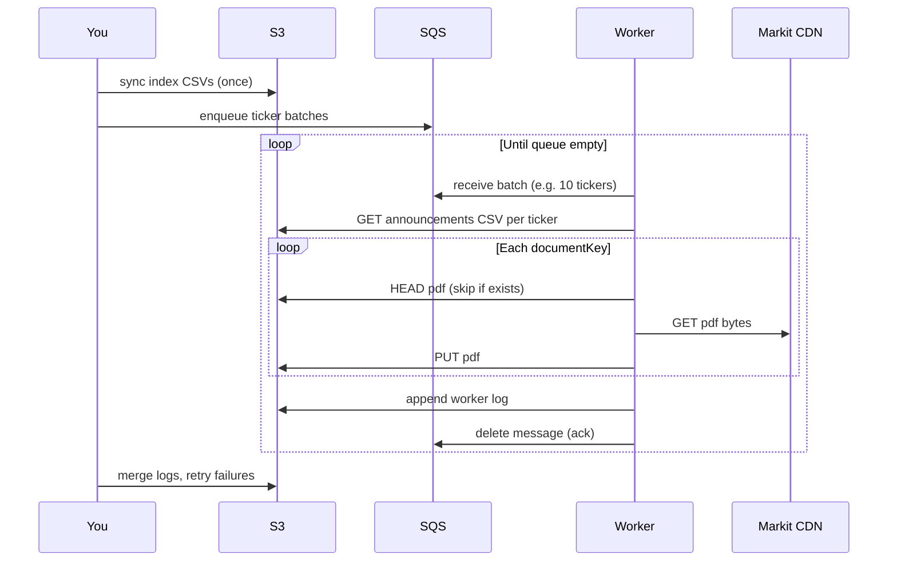

# AWS distributed fetch — Stage 2 strategy

**Status:** draft — **run soak + scaling ladder before committing to fleet architecture**  
**Scope:** Download ~1.26M ASX PDFs (~500 GB–1.2 TB) to S3 using a ticker-sharded worker fleet  
**Prerequisite:** Step 2 index complete locally (`*_Announcements.csv` per ticker)

Full execution context: [`plan.md`](plan.md). This doc is the **AWS-specific** design.

---

## How it works (plain English)

You already have a **catalog** of every document to fetch: one CSV per ticker listing every `documentKey`. Stage 2 is not “scrape the web again” — it is **download each PDF from the Markit CDN and store it in S3**, skipping anything that already exists.

The job is split into three layers:

| Layer | What it does | AWS service |
|-------|----------------|-------------|
| **Storage** | Holds index CSVs + PDFs forever | **S3** |
| **Work queue** | Hands out ticker batches to workers | **SQS** |
| **Workers** | Pull a batch, download PDFs, upload to S3 | **EC2 spot** (or Fargate) |

Nothing needs inbound access (no SSH tunnels). Each worker only makes **outbound HTTPS** calls to the Markit CDN and **outbound S3 PUT/HEAD** calls. Credentials come from an **IAM instance role** attached to the EC2 — no long-lived access keys on disk.



### Why multiple VMs?

The bottleneck is **network + CDN rate limits**, not CPU. One process at 1 req/s takes ~14 days for ~1.26M files. Ten spot VMs (each with its own public IP, each throttled to ~1 req/s) can cut that to ~1.5 days — *if* the CDN rate-limits per IP. A short **soak test** (1 VM vs 4 VMs) confirms how far to scale before 429 errors appear.

### Why S3 as source of truth?

- ~1 TB does not belong on a laptop or in git.
- S3 `HeadObject` replaces local “file exists?” checks — workers stay stateless.
- Later stages (parse, analysis) read from the same bucket.

---

## S3 layout

Mirror the local `data/` tree:

```
s3://gypsy-danger-asx/          # bucket name TBD at deploy
  entities.csv
  entities/{TICKER}/{TICKER}_Announcements.csv
  entities/{TICKER}/raw/{documentKey}.pdf
  logs/fetch/{worker_id}/{run_id}.jsonl
  manifests/completed_tickers.txt
  manifests/failed_tickers.json
```

**Index upload (once, before workers):**

```bash
aws s3 cp data/entities.csv s3://$BUCKET/entities.csv
aws s3 sync data/entities/ s3://$BUCKET/entities/ \
  --exclude "*/raw/*" \
  --include "*/raw/" \
  --include "*_Announcements.csv"
```

PDF prefix stays empty until workers fill it.

---

## AWS resources (minimal stack)

| Resource | Purpose | Notes |
|----------|---------|-------|
| **S3 bucket** | Corpus storage | Block public access; SSE-S3 encryption |
| **SQS queue** | Work distribution | Standard queue; visibility timeout > worst ticker time |
| **SQS DLQ** | Failed batches | Tickers to retry manually |
| **IAM role** | Worker permissions | `s3:GetObject`, `PutObject`, `HeadObject`; `sqs:ReceiveMessage`, `DeleteMessage` |
| **EC2 launch template** | Worker image | Amazon Linux 2023, `t3.small` or `c7g.medium |
| **Auto Scaling Group** | Spot fleet | Desired capacity = **ladder result** (not fixed at 10) |
| **Security group** | Egress only | Outbound 443; no inbound rules |

Optional later: CloudWatch dashboard for queue depth + worker count.

**Region:** `ap-southeast-2` (Sydney) — closest to ASX; adjust if your account prefers another region.

---

## Work unit: ticker batch

Each SQS message:

```json
{"tickers": ["CBA", "NAB", "WBC", "ANZ", "MQG", "WES", "WOW", "TLS", "BXB", "GMG"]}
```

Worker algorithm:

1. Poll SQS (long polling).
2. For each ticker in the message:
   - Load `{TICKER}_Announcements.csv` from S3.
   - For each `documentKey`:
     - `HeadObject` on `entities/{TICKER}/raw/{documentKey}.pdf` — skip if exists and size ≥ 50 KB.
     - Stream download from CDN → `PutObject` to S3.
     - Append one JSON line to local log.
   - Append ticker to `completed_tickers` manifest (S3 append or conditional write).
3. Upload worker log to S3.
4. Delete SQS message.

**Rate limit:** 1 req/s per worker (match current `AsxClient`). Back off on 429/503.

**Idempotency:** Safe to re-run any ticker or restart any worker — S3 HEAD is the guard.

---

## Soak test design

### Same document vs different documents?

| Test type | Same `documentKey` repeated | Different `documentKey`s |
|-----------|----------------------------|---------------------------|
| **What it measures** | Per-URL / per-IP throttle on one object | Real fetch throughput (typical production path) |
| **HTTP cache** | Must use `--no-cache` or cache hides CDN | Realistic — each URL is unique |
| **Valid for 1-VM rate probe?** | **Yes** — quick ceiling check | **Yes** — preferred |
| **Valid for multi-VM scaling ladder?** | **No** — all VMs hit one URL; doesn't test parallel corpus fetch | **Yes** — partition keys across workers |

**Recommendation:**

1. **B0 — one VM, one script** (`07_cdn_soak_test.py`): cycle through **different** `documentKey`s from one heavy ticker (e.g. CBA or BHP). Use `--no-cache`. Ramp `--rate-limit-s` (1.0 → 2.0 → 5.0) until 429s appear. Takes ~30–60 min, no AWS infra.

2. **Optional micro-probe:** repeat a **single** `documentKey` with `--no-cache --single-key` to see if the CDN treats one hot URL differently. Informative but not sufficient alone.

3. **Scaling ladder (B1+):** each worker must fetch a **disjoint set** of `documentKey`s (split by ticker or row range). Never point all workers at the same file.

### B0 — 1-VM probe (run first)

From repo root:

```bash
# Cycle 500 different PDFs from one ticker, 1 req/s, 30 min — no disk writes
python 0-work/scripts/07_cdn_soak_test.py --ticker CBA --max-requests 500 --rate-limit-s 1.0

# Push harder on same VM
python 0-work/scripts/07_cdn_soak_test.py --ticker CBA --max-requests 500 --rate-limit-s 2.0
python 0-work/scripts/07_cdn_soak_test.py --ticker CBA --max-requests 500 --rate-limit-s 5.0
```

Record: `requests`, `success`, `429`, `503`, `other_errors`, `bytes`, `elapsed_s`, `effective_rps`.

**Abort B0 ramp** when `429 + 503 > 1%` of requests or latency spikes sustained.

### What B0 tells you

| Outcome | Implication |
|---------|-------------|
| Stable at 1 req/s, fails at 5 req/s | Per-worker cap ≈ 1–2 req/s for production |
| Stable at 5+ req/s on one VM | Single VM can run multiple concurrent downloads; fleet may still help via more IPs |
| 429s even at 1 req/s | CDN may block datacenter IPs — try EC2 in `ap-southeast-2` vs laptop |

---

## Scaling ladder

Run **after B0**. Each rung uses the **same total document count** (~2,000–5,000 downloads) and **disjoint keys per worker**. Duration target: **≥30 min per rung** (or fixed request count, whichever comes first).

### Rung table

| Rung | Workers | Tickers / keys per worker | Per-worker rate | Stop if |
|------|---------|---------------------------|-----------------|---------|
| **0** | 1 (B0 probe) | 500+ keys, rotated | sweep 1→5 req/s | &gt;1% 429 |
| **1** | 1 | ~2,000 keys | best from B0 | baseline docs/hr |
| **2** | 4 | ~500 keys each, disjoint | same as B0 | docs/hr &lt; 3× rung 1 |
| **3** | 10 | ~200 keys each | same | docs/hr &lt; 8× rung 1 |
| **4** | 20 | ~100 keys each | same | docs/hr &lt; 15× rung 1 |
| **5** | 50 | ~40 keys each | same | docs/hr &lt; 35× rung 1 |
| **6** | 100 | ~20 keys each | same | docs/hr &lt; 70× rung 1 |

**Advance to the next rung when:**

- `docs/hr ≈ linear` with worker count (within ~20% of ideal: 4 workers ≈ 4× one worker)
- `429 + 503 < 1%` of requests
- No sustained backoff over 10+ minutes

**Stop climbing when:**

- Throughput **plateaus** (e.g. 50 workers ≈ 20 workers docs/hr)
- Error rate **exceeds 1%**
- Spot / account quotas block launch (request EC2 limit increase and retry)

**Chosen fleet size** = highest rung that passed. Example: linear through rung 4 (20 workers), plateau at rung 5 → **deploy 20 workers** for Phase C.

### How to partition work (no SQS required for ladder)

Use existing `--ticker` on N VMs or one machine with N processes:

```bash
# Worker 0 of 4 — tickers from a shard file
while read ticker; do
  python 0-work/scripts/03_fetch_documents.py --ticker "$ticker" --no-cache
done < shards/shard_00.txt
```

Generate shards from `entities.csv` so each ticker appears on **exactly one** shard. For ladder, prefer **small/medium tickers** first (avoid one whale dominating a single worker).

### Metrics to record (each rung)

Create `0-work/docs/soak_test_results.md`:

```markdown
## Rung N — YYYY-MM-DD
- Workers: 4
- Rate limit: 1.0 req/s per worker
- Duration: 45 min
- Requests: 7200
- Success: 7150 (99.3%)
- 429: 40 | 503: 5 | other: 5
- Bytes: 3.2 GB
- docs/hr: 9533
- vs rung 1: 3.8× (linear would be 4×) → PASS
```

### Interpreting results

| Pattern | Fleet decision |
|---------|----------------|
| Linear 1 → 4 → 20 → 50 | Use highest passing rung (50–100 OK) |
| Linear 1 → 4, flat 4 → 20 | **Global/per-ASN cap** — fleet ≈ 4–8 workers |
| Errors on laptop, fine on EC2 | Run production fetch from EC2 only |
| One ticker dominates wall time | Enable whale sub-sharding (row ranges) |

---

## Execution phases

Run **[Soak test design](#soak-test-design)** and **[Scaling ladder](#scaling-ladder)** before Phase A.

### Phase A — Bootstrap (once per account/region; after ladder sign-off)

| Step | Action | Who |
|------|--------|-----|
| A1 | `aws login` (or SSO) | Human once |
| A2 | Deploy stack (CDK/Terraform or `0-work/scripts/aws/`) | Cursor agent + CLI |
| A3 | Upload index CSVs to S3 | Agent / CLI |
| A4 | Build worker AMI or user-data script | Agent |

### Phase B — Soak test + scaling ladder (required before AWS commit)

**Goal:** Find the CDN rate ceiling and whether throughput scales with worker count. Results pick fleet size for Phase C — not the other way around.

See **[Scaling ladder](#scaling-ladder)** and **[Soak test design](#soak-test-design)** (above).

| Step | Action | Success criteria |
|------|--------|------------------|
| B0 | **1-VM CDN probe** (local or EC2) | Stable req/s, 429 rate known |
| B1 | Ladder rung **1** → **4** workers | Measure docs/hr each |
| B2 | Advance rungs while linear | Stop at first non-linear or &gt;1% 429 |
| B3 | Record chosen fleet size | Document in `0-work/docs/soak_test_results.md` |

**Do not deploy full S3+SQS stack until B0–B2 complete.** Phase B can run with existing `03_fetch_documents.py` on local disk or a single EC2 — no bucket required for the probe.

### Phase C — Full fetch (after ladder sign-off)

| Step | Action |
|------|--------|
| C1 | Enqueue all ~1,838 tickers (skip `completed_tickers.txt`) |
| C2 | Scale ASG to chosen worker count |
| C3 | Monitor queue depth → 0 |
| C4 | Merge worker jsonl logs → `fetch_log.json` |
| C5 | Retry pass on failed `documentKey`s |

### Phase D — Cutover

Local `data/entities/*/raw/` becomes optional cache. Parse stage reads from S3.

---

## Code to add (repo)

| Artifact | Purpose |
|----------|---------|
| `0-work/infra/` | CDK app: bucket, queue, IAM, ASG |
| `0-work/scripts/storage.py` | `StorageBackend`: `local` \| `s3` |
| `0-work/scripts/04_enqueue_fetch_jobs.py` | Push ticker batches to SQS |
| `0-work/scripts/05_fetch_worker.py` | SQS consumer → S3 upload |
| `0-work/scripts/06_merge_fetch_logs.py` | Consolidate jsonl logs |
| `0-work/scripts/07_cdn_soak_test.py` | B0 CDN probe — rate limit sweep, no PDF writes |
| Refactor `03_fetch_documents.py` | Delegate to shared `fetch_ticker()` |

Env vars: `GYPSY_S3_BUCKET`, `GYPSY_SQS_QUEUE_URL`, `AWS_REGION=ap-southeast-2`.

---

## Operating from Cursor

| Task | Console required? | How |
|------|-------------------|-----|
| Create bucket, queue, IAM, EC2 | **No** | AWS CLI / CDK via agent after `aws login` |
| Upload index | **No** | `aws s3 sync` |
| Run workers | **No** | ASG scales spot instances; user-data starts worker |
| Debug / retry | **No** | Re-enqueue failed tickers; merge logs |
| View progress | Optional | S3 console or `aws s3 ls`; SQS queue depth |

**One-time human steps:** AWS account, `aws login`, approve CDK bootstrap.

**AWS MCP:** Agent can call AWS APIs through MCP once CLI credentials + MCP server are configured (see [`0-work/docs/aws-setup.md`](../docs/aws-setup.md)).

---

## Cost sketch (ap-southeast-2, rough)

| Item | One-time / monthly |
|------|---------------------|
| S3 ~1 TB Standard | ~USD 25/mo |
| S3 PUT ~1.26M | ~USD 6 once |
| 10× spot t3.small × ~2 days | ~USD 5–15 once |
| SQS | &lt; USD 1 once |
| **Total fetch run** | **~USD 15–35** + storage |

---

## What we are not doing

- Kubernetes — ops overhead for a batch job.
- E2B sandboxes — wrong model for multi-day I/O workers.
- Inbound tunnels or SSH — not needed.
- Download-all-then-upload — stream CDN → S3 per file.

---

## Open decisions

- Exact bucket name and CDK vs raw CloudFormation
- Spot vs On-Demand for first full run (spot recommended)
- Whale ticker sub-sharding (defer until soak metrics show skew)
- **Fleet size** — set by scaling ladder, not guessed upfront
