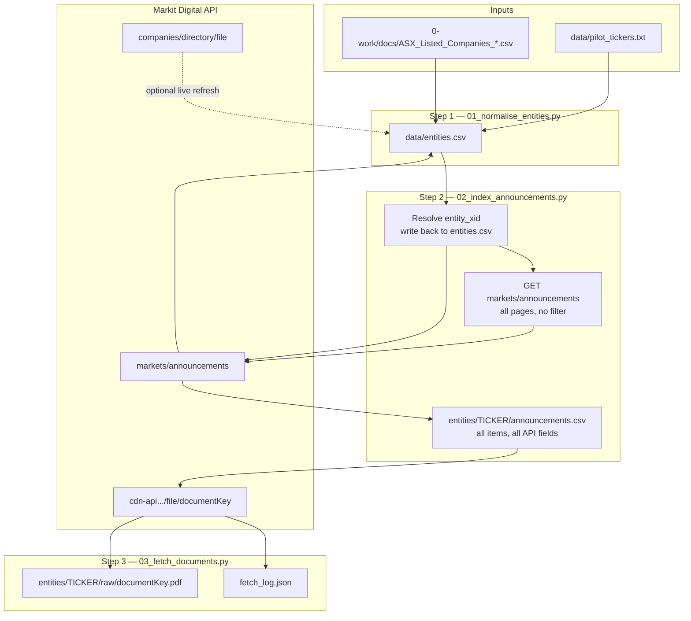
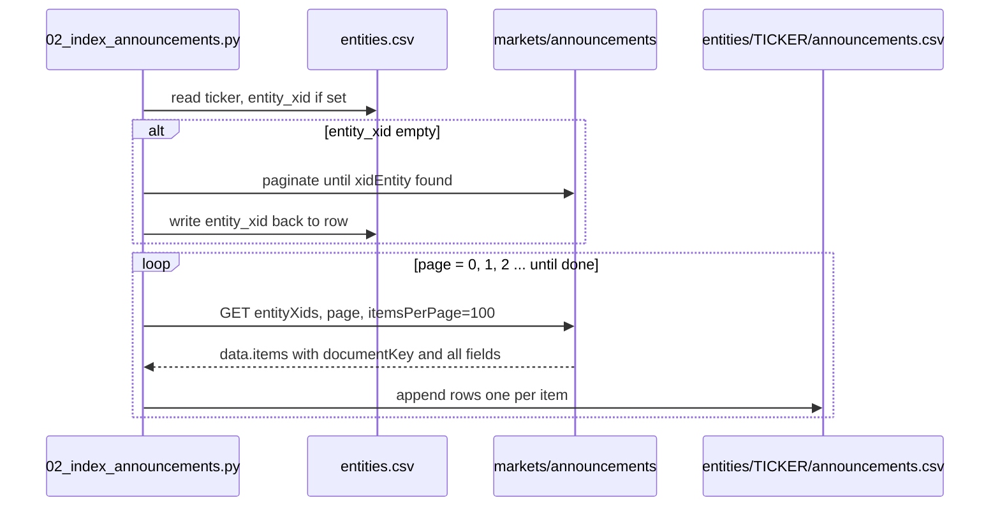
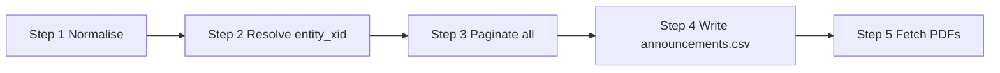

# Gypsy Danger — Execution Plan

Hypothesis, research questions, and fetch structure: [`0-work/docs/spec.md`](../docs/spec.md).

**Active workstream:** Stage 1 — Phase 2 (test run), after Phase 1 scripts built.

API reference: [`0-work/docs/links.md`](../docs/links.md).

---

## Numbering scheme

| Level | Label | Example |
|-------|-------|---------|
| **Stage** | End-to-end project phase | Stage 1 Test, Stage 2 Fetch |
| **Phase** | Execution block within a stage | Phase 0 Prep, Phase 1 Build, Phase 2 Test run |
| **Step** | One script invocation in the fetch pipeline | Step 1, Step 2, Step 3 |
| **Script** | Indexed filename under `0-work/scripts/` | `01_normalise_entities.py` |

---

## Stage 1 — Fetch pipeline scripts

| Step | Script | Command |
|------|--------|---------|
| — | [`00_asx_api.py`](../scripts/00_asx_api.py) | *(library — not run directly)* |
| **1** | [`01_normalise_entities.py`](../scripts/01_normalise_entities.py) | `python 0-work/scripts/01_normalise_entities.py [--pilot-only]` |
| **2** | [`02_index_announcements.py`](../scripts/02_index_announcements.py) | `python 0-work/scripts/02_index_announcements.py [--pilot-only]` |
| **3** | [`03_fetch_documents.py`](../scripts/03_fetch_documents.py) | `python 0-work/scripts/03_fetch_documents.py [--pilot-only]` |

Shared library `00_asx_api.py` holds paths, HTTP client, URL builders, and API helpers.

**Full pipeline (pilot):**

```bash
python 0-work/scripts/01_normalise_entities.py --pilot-only
python 0-work/scripts/02_index_announcements.py --pilot-only
python 0-work/scripts/03_fetch_documents.py --pilot-only
```

Log every run in [`0-work/scripts/log.md`](../scripts/log.md).

---

End-to-end data flow for Stage 1 (pilot) and Stage 2 (full ASX). Same pipeline; Stage 2 removes the pilot filter and runs at scale.



### Per-company sequence (Step 2 detail)



### What each API call returns

| Call | You send | You get back |
|------|----------|--------------|
| Directory | — | Ticker, name, GICS, market cap (CSV) |
| Announcements (paginated) | `entityXids`, `page` | `count`, `items[]` each with **`documentKey`**, `headline`, `date`, `announcementTypes`, `companyInfo[].xidEntity` |
| CDN / file | `documentKey` in URL | PDF bytes |

---

## Execution map

How we run this, in order. Stage 1 first; Stage 2 reuses the same scripts.

### Phase 0 — Prep (manual, once)

| # | Action | Output |
|---|--------|--------|
| 0.1 | Choose ~10–20 pilot tickers | `data/pilot_tickers.txt` — run `00_pick_pilot_tickers.py` or edit manually |
| 0.2 | Confirm entity CSV present (or use live directory API) | `0-work/docs/ASX_Listed_Companies_*.csv` |
| 0.3 | Add `data/` to `.gitignore` for `cache/`, `entities/**/raw/*.pdf` | gitignore updated |

### Phase 1 — Build scripts (complete)

| # | Script | Step | Responsibility |
|---|--------|------|----------------|
| 1.0 | `00_asx_api.py` | — | Shared API client, paths, helpers |
| 1.1 | `01_normalise_entities.py` | 1 | Source CSV → `entities.csv`; `--pilot-only` |
| 1.2 | `02_index_announcements.py` | 2 | Resolve `entity_xid` → update `entities.csv`; paginate all announcements → `entities/{TICKER}/announcements.csv` |
| 1.3 | `03_fetch_documents.py` | 3 | Read per-ticker `announcements.csv`; download every `documentKey` → `raw/` |

```bash
python 0-work/scripts/01_normalise_entities.py --pilot-only
python 0-work/scripts/02_index_announcements.py --pilot-only
python 0-work/scripts/03_fetch_documents.py --pilot-only
```

All runs logged to [`0-work/scripts/log.md`](../scripts/log.md).

### Phase 2 — Stage 1 test run (pilot)

| # | Step | Verify |
|---|------|--------|
| 2.1 | Run Step 1 on pilot list | `entities.csv` row count = pilot tickers |
| 2.2 | Run Step 2 on pilot list | Every pilot row has `entity_xid`; `entities/{TICKER}/announcements.csv` exists with all items |
| 2.3 | Spot-check 2–3 tickers vs ASX announcements page | Row counts and headlines match |
| 2.4 | Run Step 3 | PDFs in `raw/`; `fetch_log.json` success rate acceptable |
| 2.5 | Open 2–3 downloaded PDFs | Valid PDFs |
| 2.6 | Write observations | `0-work/docs/stage1_observations.md` — gaps, fixes, go/no-go |

**Stage 1 success criteria:** Pilot tickers in `entities.csv` with `entity_xid`; full announcement index per ticker; all documents downloaded (or failures logged); pipeline idempotent on re-run.

### Phase 3 — Stage 2 full fetch (AWS)

**Architecture:** [`aws-distributed-fetch.md`](aws-distributed-fetch.md) — S3 corpus + SQS ticker batches + EC2 spot workers.

| # | Step | Notes |
|---|------|-------|
| 3.0 | Index complete locally | ✅ ~1,838 tickers, ~1.26M `documentKey` rows (Step 2 done) |
| 3.1 | Deploy AWS stack | S3 bucket, SQS, IAM, spot worker ASG — via CDK/CLI from Cursor after `aws login` |
| 3.2 | Upload index to S3 | `entities.csv` + `*_Announcements.csv` only (no PDFs yet) |
| 3.3 | Soak test | 1 vs 4 workers × 2 h → pick fleet size |
| 3.4 | Enqueue + run workers | `04_enqueue_fetch_jobs.py` → scale ASG → stream PDFs CDN → S3 |
| 3.5 | Merge logs + retry | `06_merge_fetch_logs.py`; re-enqueue failed tickers |

### Phase 4+ — Later (not Stage 1)

| Stage | When | What |
|-------|------|------|
| Stage 3 Parse | After fetch stable | Split PDFs → financials / auditor / body |
| Stage 4 Analysis | After parse | Themes, temporal graph, research questions |

---

## Inputs

### Entity index

Source: [`0-work/docs/ASX_Listed_Companies_30-06-2026_11-15-18_AEST.csv`](../docs/ASX_Listed_Companies_30-06-2026_11-15-18_AEST.csv) (~1,839 rows).

Live equivalent: `GET https://asx.api.markitdigital.com/asx-research/1.0/companies/directory/file`

| Source column | Normalised column | Notes |
|---------------|-------------------|-------|
| ASX code | `ticker` | Primary key |
| Company name | `name` | |
| GICs industry group | `gics_industry_group` | |
| Listing date | `listing_date` | |
| Market Cap | `market_cap_aud` | Integer AUD; some rows are `SUSPENDED` |
| *(Step 2)* | `entity_xid` | Markit `xidEntity`; empty until Step 2 resolves it |

**Central source of truth:** `data/entities.csv` holds ticker metadata **and** `entity_xid`. Step 2 writes `entity_xid` back into this file — no separate xid cache file.

Stage 1 Step 1 normalises the source CSV → `data/entities.csv`.

### Pilot tickers

File: `data/pilot_tickers.txt` — one ASX code per line (~10–20 tickers).

**Placeholder — fill before Stage 1 execution:**

```
# Add one ticker per line, e.g.:
# CBA
# BHP
# TLS
```

All Stage 1 scripts accept `--pilot-only` to filter to this list.

---

## ASX API model (Stage 1)

Stage 1 uses the **Markit Digital JSON API**, not HTML scraping.



### Two IDs

| ID | Role | Source |
|----|------|--------|
| **`entity_xid`** | Company id for paginated announcements | `companyInfo[0].xidEntity` from API; stored on **`entities.csv`** |
| **`documentKey`** | One PDF file | Every row in `data.items[]`; stored on **`entities/{TICKER}/announcements.csv`** |

No document-type filtering in Stage 1 — index and fetch **all** announcements returned by the API.

### Announcements API

```
GET https://asx.api.markitdigital.com/asx-research/1.0/markets/announcements
    ?entityXids={entity_xid}
    &page={0-based}
    &itemsPerPage={100}
```

Paginate until `page * itemsPerPage >= data.count`. No `announcementTypes` filter.

Example item:

```json
{
  "date": "2025-08-12T21:30:27.000Z",
  "headline": "2025 Annual Report",
  "documentKey": "2924-02977830-2A1613327",
  "announcementTypes": ["Annual Report", "Full Year Accounts"],
  "fileSize": "564KB",
  "isPriceSensitive": false,
  "symbol": "CBA",
  "symbolsSecondary": ["CBA", ""],
  "url": "",
  "companies": [{"symbolDisplay": "CBA"}],
  "companyInfo": [{ "symbol": "CBA", "xidEntity": 204245597, ... }]
}
```

### PDF download

Build URL from `documentKey`:

```
https://cdn-api.markitdigital.com/apiman-gateway/ASX/asx-research/1.0/file/{documentKey}&v=undefined
```

Alternative: `https://asx.api.markitdigital.com/asx-research/1.0/file/{documentKey}`

---

## Stage 1 — Test pipeline

Prove normalise → index → fetch on pilot tickers. **All documents**, no type filter. No parse, no AI.

### Step 1 — Normalise entities

**Script:** `01_normalise_entities.py`

1. Read `0-work/docs/ASX_Listed_Companies_*.csv` (or fetch live directory API)
2. Write `data/entities.csv` with columns: `ticker`, `name`, `gics_industry_group`, `listing_date`, `market_cap_aud`, `entity_xid` (empty)
3. With `--pilot-only`, filter to tickers in `data/pilot_tickers.txt`

### Step 2 — Index announcements

**Script:** `02_index_announcements.py`

For each row in `entities.csv`:

1. **Resolve `entity_xid`** if blank:
   - Bootstrap via paginated `markets/announcements` until an item matches ticker; read `companyInfo[0].xidEntity`
   - **Write `entity_xid` back to `data/entities.csv`** (same row, central source of truth)
   - Manual override in `data/overrides.json` for edge cases (see `data/overrides.json.example`)

2. **Paginate all announcements** for `entity_xid` (no type filter)

3. **Write `data/entities/{TICKER}/announcements.csv`** — one row per `data.items[]` entry

**`announcements.csv` columns** (source of truth for retries and later filtered fetches):

| Column | Source |
|--------|--------|
| `ticker` | From `entities.csv` |
| `entity_xid` | From `entities.csv` |
| `documentKey` | API item |
| `date` | API item |
| `headline` | API item |
| `fileSize` | API item |
| `isPriceSensitive` | API item |
| `symbol` | API item |
| `url` | API item |
| `announcementTypes` | API item — JSON array serialized |
| `companies` | API item — JSON array serialized |
| `companyInfo` | API item — JSON array serialized |
| `symbolsSecondary` | API item — JSON array serialized |

Idempotent: re-run overwrites or merges `announcements.csv` for that ticker (same `documentKey` = same row).

Annual reports and other types are filtered **later** by querying this CSV — not during Stage 1 fetch.

### Step 3 — Fetch documents

**Script:** `03_fetch_documents.py`

1. For each `data/entities/{TICKER}/announcements.csv`, read every row with a `documentKey`
2. Download from CDN; save to `data/entities/{TICKER}/raw/{documentKey}.pdf`
3. Log to `data/fetch_log.json`:

```json
{
  "success": [{"ticker": "CBA", "document_key": "...", "file": "..."}],
  "skipped": [{"ticker": "CBA", "document_key": "...", "reason": "exists"}],
  "failed": [{"ticker": "CBA", "document_key": "...", "error": "..."}]
}
```

4. Rate limit (suggest 1 req/s between uncached calls)
5. HTTP cache in `data/cache/` (gitignored)
6. Idempotent: skip if PDF exists and > 50 KB
7. Recovery: retry with backoff; manual overrides in `data/overrides.json`

### Stage 1 exit checklist

- [ ] Pilot tickers in `data/pilot_tickers.txt`
- [ ] `data/entities.csv` normalised with `entity_xid` for every pilot ticker
- [ ] `data/entities/{TICKER}/announcements.csv` for every pilot ticker
- [ ] PDFs on disk under `data/entities/{TICKER}/raw/{documentKey}.pdf`
- [ ] `data/fetch_log.json` reviewed
- [ ] `0-work/docs/stage1_observations.md` — gaps, fixes, go/no-go for Stage 2

---

## Papal Papers patterns (reuse across stages)

From [RESEARCH_APPROACH.md](https://github.com/nirubanxp413/papalpapers/blob/27a5b694a2c0bf988adbc15d426fb7c6b6622ddc/RESEARCH_APPROACH.md):

| Pattern | Stage 1 | Stages 3–4 |
|---------|---------|------------|
| Index before download | `entities.csv`, `entities/{TICKER}/announcements.csv` | Extend per-ticker CSV or add derived indexes |
| Disk as source of truth | Skip existing PDFs | Skip existing parse/analysis outputs |
| Audit logs | `fetch_log.json` | `parse_log.json`, `run_log.jsonl` per AI pass |
| Checklist orchestration | Not used | One checklist per AI pass |
| Model tiering | Not used | Cheap/local for open themes; stronger model on filtered subset |

---

## Stage 2 — Full fetch (AWS)

**Design doc:** [`aws-distributed-fetch.md`](aws-distributed-fetch.md)

After Stage 1 sign-off (or with index already built — current state):

1. **Index** — Step 2 complete for ~1,838 tickers locally; upload manifests to **S3**.
2. **Fetch** — Step 3 at scale via **SQS + EC2 spot workers** writing PDFs directly to S3 (not local disk).
3. **Monitor** — queue depth, worker logs, CDN 429s; retry failures from DLQ / failed manifest.
4. **Validate** — sample tickers: announcement row count ≈ S3 object count under `raw/`.

New scripts: `04_enqueue_fetch_jobs.py`, `05_fetch_worker.py`, `06_merge_fetch_logs.py`, S3 storage backend, CDK stack under `0-work/infra/`.

---

## Stage 3 — Parse (placeholder)

**Scope (future):** split each annual report into:

- Standardised financial statements (JSON)
- Auditor's report (markdown)
- Remainder of report (markdown with frontmatter)

**Design TBD** after inspecting fetched PDFs from Stage 1/2.

---

## Stage 4 — Analysis & reporting (placeholder)

**Scope (future):** answer the three research questions in [`spec.md`](../docs/spec.md).

---

## Open decisions

- Pilot ticker list
- Bootstrap strategy for first-time `entity_xid` resolution
- ~~Git strategy for large PDF corpus~~ → **resolved:** S3 source of truth (see [`aws-distributed-fetch.md`](aws-distributed-fetch.md))
- Exact S3 bucket name and spot fleet size (after soak test)

---

## Repository layout (target)

```
prj-gypsydanger/
├── 0-work/
│   ├── docs/
│   │   ├── spec.md
│   │   ├── links.md                  # API URLs and id mapping
│   │   ├── ASX_Listed_Companies_*.csv
│   │   └── stage1_observations.md
│   ├── plans/
│   │   ├── plan.md
│   │   └── aws-distributed-fetch.md
│   ├── infra/                        # CDK: S3, SQS, EC2 workers (Stage 2)
│   └── scripts/
│       ├── 00_asx_api.py
│       ├── 01_normalise_entities.py
│       ├── 02_index_announcements.py
│       └── 03_fetch_documents.py
├── data/
│   ├── entities.csv                  # central index: ticker + entity_xid + metadata
│   ├── pilot_tickers.txt
│   ├── fetch_log.json
│   ├── cache/
│   └── entities/{TICKER}/
│       ├── announcements.csv         # all API items for this ticker
│       └── raw/{documentKey}.pdf
└── requirements.txt
```
