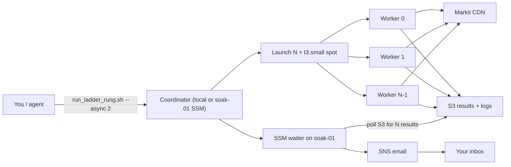

# Scaling ladder — execution design

**Status:** ready to run (after B0 baseline)  
**Prerequisite:** B0 complete on EC2 at 1 req/s  
**Parent:** [`aws-distributed-fetch.md`](aws-distributed-fetch.md)

---

## Goal

Find how many **parallel EC2 workers** (each with its own public IP) the Markit CDN tolerates before throughput stops scaling linearly or errors exceed 1%.

**Output:** a chosen fleet size for Phase C (SQS + ASG full fetch).

---

## Baseline (B0 — done)

| Metric | Value |
|--------|-------|
| Workers | 1 (`gypsy-danger-soak-01`) |
| Rate limit | 1.0 req/s |
| Requests | 500 |
| Success | 100% |
| **docs/hr per worker** | **~1,271** |
| Elapsed | ~24 min |

All ladder rungs compare aggregate throughput to **N × 1,271 docs/hr** (within 20% = pass).

---

## Key pool (shared across rungs)

Each rung downloads the **same 2,000 unique `documentKey`s**, split evenly across workers.

| Item | Value |
|------|-------|
| Pool size | 2,000 keys |
| Source | Medium tickers (100–400 announcements each), round-robin |
| Storage | `s3://$BUCKET/ladder/pool/document_keys.txt` |
| Shards | `s3://$BUCKET/ladder/shards/{N}workers/shard_{WW}.txt` |

Build once:

```bash
python3 0-work/scripts/08_build_ladder_pool.py
aws s3 sync data/ladder/ s3://$GYPSY_S3_BUCKET/ladder/
```

Regenerate shards when worker count changes (script does this automatically in `run_ladder_rung.sh`).

---

## Rung table

Fixed **2,000 total requests** per rung. Per-worker rate limit **1.0 req/s** (B0 winner). Each worker uses **disjoint keys**.

| Rung | Workers | Keys / worker | Expected aggregate docs/hr | Pass if |
|------|---------|---------------|---------------------------|---------|
| **1** | 1 | 2,000 | ~1,271 | Baseline (confirm pool) |
| **2** | 4 | 500 | ~5,084 | ≥ 4,067 (0.8×4×1271) |
| **3** | 10 | 200 | ~12,710 | ≥ 10,168 |
| **4** | 20 | 100 | ~25,420 | ≥ 20,336 |
| **5** | 50 | 40 | ~63,550 | ≥ 50,840 |
| **6** | 100 | 20 | ~127,100 | ≥ 101,680 |

**Stop climbing when:**

- Aggregate docs/hr **&lt; 80% of linear** vs rung 1 baseline
- **429 + 503 &gt; 1%** of total requests
- EC2 launch fails (account vCPU limit — request increase and retry)

**Fleet choice:** highest rung that passed. Example: linear through rung 4, plateau at rung 5 → deploy **20 workers** for full fetch.

---

## Architecture per rung

Each worker is a **separate EC2 instance** (unique public IP). Workers on the same VM would not test CDN per-IP limits.



### Why separate instances?

CDN rate limits are often **per IP / per ASN**. Multiple processes on one EC2 share one IP → rung 2+ would falsely show no scaling.

---

## IP burn rotation

AWS has **no managed rotating-proxy service**. The pattern is: **terminate the EC2 instance → launch a new one → new public IP**.

| Signal | Threshold (default) | Action |
|--------|---------------------|--------|
| Rolling 429+503 rate | &gt; 1% over last 50 requests (after 20 min requests) | Worker exits code `2`, uploads `burned: true` to S3 |
| Consecutive 429s | ≥ 5 | Same |

Coordinator (`ladder_wait_and_notify.sh` on soak-01):

1. Polls `worker_XX.json` in S3
2. If `burned: true` and not `complete`: terminate instance, relaunch via `launch_ladder_worker.sh` with `--start-offset` = keys already done
3. Max **3 rotations per worker slot** (`GYPSY_BURN_MAX_ROTATIONS`)
4. When all slots report `complete: true`, aggregate and SNS notify

Scripts: `00_asx_api.CdnBurnTracker`, `07_cdn_soak_test.py`, `aws/launch_ladder_worker.sh`.

Phase C production fetch uses the same burn exit code on `03_fetch_documents.py`; ASG or the SQS coordinator replaces burned workers the same way.

---

## How to run (async + email)

### One-time setup

```bash
set -a && source 0-work/scripts/.env && set +a

# Email notifications (SNS — confirm subscription in inbox)
0-work/scripts/aws/bootstrap_notifications.sh

# Build key pool + upload
python3 0-work/scripts/08_build_ladder_pool.py
aws s3 sync data/ladder/ s3://$GYPSY_S3_BUCKET/ladder/
```

Set in `0-work/scripts/.env`:

```bash
GYPSY_NOTIFY_EMAIL=you@example.com
GYPSY_SNS_TOPIC_ARN=arn:aws:sns:ap-southeast-2:691811257790:gypsy-danger-notify
```

### Run a rung (fire-and-forget)

```bash
# Rung 2 = 4 workers — exits immediately; email when complete
0-work/scripts/aws/run_ladder_rung.sh --async 2
```

### Single soak (B0-style) with email

```bash
0-work/scripts/aws/run_soak_on_ec2.sh --async 500 1.0
```

You receive **one SNS email** with the soak summary and log tail. No need to keep Cursor or the agent running.

---

## Timing estimates (per rung)

Per-worker duration ≈ `keys × (rate_limit + 7s download)`:

| Rung | Workers | Keys/worker | ~Duration |
|------|---------|-------------|-----------|
| 1 | 1 | 2,000 | ~4.5 h |
| 2 | 4 | 500 | ~1.1 h |
| 3 | 10 | 200 | ~27 min |
| 4 | 20 | 100 | ~13 min |
| 5 | 50 | 40 | ~5 min |
| 6 | 100 | 20 | ~3 min |

Rung 1 is long — optional skip if B0 at 500 keys is enough baseline; use rung 2 as first scaling test.

---

## Results recording

Append each rung to [`0-work/docs/soak_test_results.md`](../docs/soak_test_results.md). Waiter also writes:

`s3://$BUCKET/logs/ladder/rung{N}/summary.json`

---

## Cost sketch (ladder only)

| Rung | Instances × ~duration | Spot cost (rough) |
|------|----------------------|-------------------|
| 2 | 4 × 1.1 h | &lt; USD 1 |
| 4 | 20 × 15 min | &lt; USD 1 |
| 6 | 100 × 5 min | USD 2–5 |

Terminate workers after each rung (script default).

---

## Recommended sequence

1. **Confirm email** — `bootstrap_notifications.sh`, click SNS confirm link
2. **Build pool** — `08_build_ladder_pool.py` + S3 sync
3. **Rung 2 (4 workers)** — first real scaling signal (~1 h, async)
4. If linear → **rung 4 (20)** — skip 10 if 4 looks good
5. If still linear → **rung 6 (100)** or stop at plateau
6. Record chosen fleet → Phase C (SQS + ASG)

---

## Open items

- EC2 vCPU quota for 50–100 instances (check Service Quotas)
- Spot vs on-demand for ladder (spot default; fall back if insufficient capacity)
- Rung 1 optional (2000 keys × 1 worker is slow; B0 already gives baseline)
