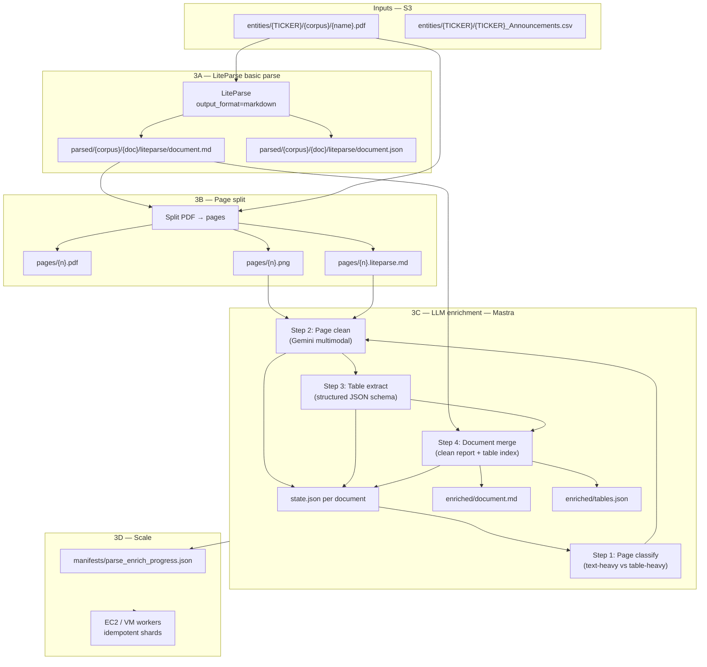

# Stage 3 — LiteParse + LLM enrichment pipeline

**Goal:** Turn raw PDFs into **clean, structured report artefacts** (especially financial tables) suitable for Stage 4 temporal graph and leakage analysis — without LlamaParse credit costs.

**Parent:** [`spec.md`](../docs/spec.md) · **Prior parse draft:** [`parse-spec.md`](../docs/parse-spec.md) (superseded on reader choice — see § Reader decision)

**Pilot corpus:** [`data/parse-sample-corpus/`](../data/parse-sample-corpus/) — 100 PDFs with LiteParse + open-parse outputs.

---

## Summary

| Phase | What | Output |
|-------|------|--------|
| **3A** | LiteParse basic parse | Per-PDF markdown + spatial JSON |
| **3B** | Page split | Per-page PDF + PNG (+ page-level LiteParse slice) |
| **3C** | LLM enrichment (Gemini via Mastra) | Cleaned markdown, structured tables, document manifest |
| **3D** | Scale-out | Batch runner over full S3 corpus with progress manifests |
| **2E** *(parallel)* | Expand fetch | Additional announcement types beyond annual + CFO |

LlamaParse is **out of scope** for cost reasons (~11M credits for full annual corpus). LiteParse is local/fast; LLM cost is bounded and controllable per page.

---

## Architecture



---

## Corpus priority (parse order)

| Priority | Corpus | S3 prefix | Count | Avg pages/PDF | Notes |
|----------|--------|-----------|------:|--------------:|-------|
| 1 | Annual reports | `entities/{TICKER}/annual_reports/` | ~22,560 | ~50 | Primary leakage signal |
| 2 | CFO changes | `entities/{TICKER}/cfo_changes/` | 2,133 | ~1.4 | Leadership-change events |
| 3+ | TBD (fetch expansion) | per § Parallel fetch track | — | — | Appendix 4G, 4E, etc. |

---

## Phase 3A — LiteParse basic parse

**Purpose:** Fast, local, layout-aware first pass. No cloud parse credits.

### Inputs
- PDF from S3 (or local mirror)
- Announcement metadata from index CSV (ticker, date, headline, `announcementTypes`)

### Processing
```python
from liteparse import LiteParse

parser = LiteParse(
    output_format="markdown",
    image_mode="placeholder",
    extract_links=True,
    quiet=True,
    # ocr_enabled=True  # enable per-doc or for scanned pages (Phase 3B classifier)
)
result = parser.parse(pdf_bytes)
```

### Outputs (per document)
```
parsed/{corpus}/{TICKER}/{doc_id}/
  liteparse/
    document.md          # full markdown
    document.json        # pages[], text_items summary, stats
    manifest.json        # parser version, page_count, char_count, elapsed_s
```

### Script
| Script | Role |
|--------|------|
| `22_liteparse_document.py` | Single-PDF parse (S3 → output prefix) |
| `23_liteparse_shard.py` | Shard worker (multi-doc, progress upload) |
| `aws/run_liteparse_parse.sh` | Orchestrator (shards, EC2, SNS) — mirror Phase C pattern |

### Pilot gate
- Run on `data/parse-sample-corpus/` (100 PDFs) — **done**
- Run on 10 pilot tickers (~200–500 PDFs) before full corpus
- Validate: markdown table count, OCR need rate, failure rate

### Learnings from sample (100 PDFs)
- LiteParse: **100/100** success, ~0.1–0.3s/page for born-digital annual reports
- Annual reports: **~50 markdown tables/PDF** (heuristic); CFO notices: 0–2 tables
- open-parse: 99/100 (one pdfminer image failure); fragmented nodes, no markdown tables
- **Decision:** LiteParse is primary reader; open-parse optional for bbox QA only

---

## Phase 3B — Page split

**Purpose:** Give the LLM stage page-sized units — PDF for structure, PNG for vision, LiteParse slice for text anchor.

### Processing
1. Split source PDF into single-page PDFs (`pypdf` or `pymupdf`)
2. Render each page to PNG (300 DPI default; LiteParse `lit screenshot` or `pymupdf`)
3. Slice LiteParse output by `page_num` → per-page markdown + text_items subset

### Outputs
```
parsed/{corpus}/{TICKER}/{doc_id}/
  pages/
    manifest.json           # page_count, dimensions, render_dpi
    001/
      page.pdf
      page.png
      liteparse.md          # page-scoped markdown from 3A
      liteparse.json        # text_items for this page
    002/
      ...
```

### Script
| Script | Role |
|--------|------|
| `24_split_pdf_pages.py` | Split + render + slice LiteParse JSON |
| `25_build_parse_shards.py` | Shard documents for workers |

### Design notes
- Page numbers: 1-based, zero-padded 3 digits (`001` … `120`)
- Store page count in all downstream state keys
- Skip empty pages (no text_items and blank render) — log in manifest
- Large PDFs (GMG 2022, 100+ pages): process pages lazily; do not load all PNGs into memory

---

## Phase 3C — LLM enrichment (Gemini + Mastra)

**Purpose:** Produce a **cleaned report** and **structured tables** from LiteParse draft + page images. Multi-step with explicit state.

### Why Mastra
- Workflow / agent orchestration with **durable step state**
- Retry, resume, and human-in-the-loop hooks
- Clean separation: parse (deterministic) vs enrich (LLM)
- Alternative: direct Gemini API in Python if Mastra is heavy for v1 — plan supports both; **Mastra preferred** for production state management

### State model (per document)

`parsed/{corpus}/{TICKER}/{doc_id}/state.json`:

```json
{
  "doc_id": "CBA_2024_2924-02860163-2A1552191",
  "corpus": "annual",
  "ticker": "CBA",
  "s3_pdf_key": "entities/CBA/annual_reports/...",
  "page_count": 56,
  "pipeline_version": "3c-v1",
  "steps": {
    "3a_liteparse": { "status": "complete", "at": "..." },
    "3b_split":     { "status": "complete", "at": "...", "pages": 56 },
    "3c_classify":  { "status": "complete", "at": "...", "pages_done": 56 },
    "3c_clean":     { "status": "running",  "at": "...", "pages_done": 23 },
    "3c_tables":    { "status": "pending" },
    "3c_merge":     { "status": "pending" }
  },
  "pages": {
    "001": {
      "classify": "table_heavy",
      "clean_status": "complete",
      "tables_status": "complete",
      "error": null
    }
  }
}
```

**Rules**
- Each step writes only its slice of state; runner checks `steps.*.status` before advancing
- Page-level idempotency: skip pages where `clean_status == complete`
- Failures: set `error`, do not advance; retry from failed page
- Global manifest aggregates doc-level status for SNS / progress email

### Sub-steps

#### 3C-1 — Page classify
- **Input:** `pages/{n}/liteparse.md`, optional `page.png` thumbnail
- **Output:** `table_heavy` | `text_heavy` | `mixed` | `skip` (blank)
- **Model:** Gemini Flash (cheap, fast)
- **Purpose:** Route table-heavy pages to stronger table extraction prompt

#### 3C-2 — Page clean
- **Input:** `page.png` + `liteparse.md` (LiteParse draft as anchor)
- **Output:** `pages/{n}/cleaned.md` — corrected text, headings, reading order
- **Model:** Gemini Pro or Flash with vision
- **Prompt focus:** Fix column order, merge broken lines, preserve numbers exactly

#### 3C-3 — Table extract
- **Input:** `page.png` + `cleaned.md` (for table-heavy/mixed pages only)
- **Output:** `pages/{n}/tables.json` — array of tables matching schema (below)
- **Model:** Gemini Pro with structured output / JSON schema

#### 3C-4 — Document merge
- **Input:** all `cleaned.md` + all `tables.json` + original `document.md`
- **Output:**
  - `enriched/document.md` — full cleaned report
  - `enriched/tables.json` — merged table index with doc-level metadata
  - `enriched/manifest.json` — counts, model versions, token usage

### Table schema (v1 draft — lock on pilot)

```json
{
  "table_id": "p012_t01",
  "page_num": 12,
  "title": "Consolidated statement of comprehensive income",
  "statement_type": "income",
  "unit": "$m",
  "currency": "AUD",
  "columns": ["2024", "2023"],
  "rows": [
    { "label": "Revenue", "values": [98234, 89102] },
    { "label": "EBITDA", "values": [12345, 11200] }
  ],
  "confidence": 0.92,
  "source": "gemini-3c-3"
}
```

Refine after reviewing 10 pilot documents against [`parse-spec.md`](../docs/parse-spec.md) § Parse B.

### Mastra workflow sketch

```
workflows/
  enrich-document.ts       # orchestrates 3C-1 … 3C-4
  steps/
    classify-page.ts
    clean-page.ts
    extract-tables.ts
    merge-document.ts
```

Runner invokes Mastra via HTTP or CLI; Python parse stages (3A, 3B) remain in `0-work/scripts/`. Bridge: `26_invoke_enrich_workflow.py`.

### Cost control
| Lever | Approach |
|-------|----------|
| Model routing | Flash for classify + text pages; Pro for table-heavy only |
| Page budget | Cap pages/doc for v1 pilot; skip duplicates (revision PDFs) |
| Caching | Hash `(page.png, prompt_version)` → skip re-enrich on resume |
| Batch API | Gemini batch for 3C-2/3C-3 at scale (lower $, higher latency) |

**Rough estimate (annual corpus):** ~1.15M pages × ~$0.001–0.01/page (model-dependent) = **$1k–12k** vs LlamaParse ~11M credits. Pilot 100 docs first to measure actual tokens/page.

---

## Phase 3D — Scale-out

**Pattern:** Reuse Phase C fetch architecture (shards, EC2 workers, burn rotation, SNS, progress manifest).

### Stages at scale
1. **3A only** — LiteParse all annual reports (~22k PDFs). Local CPU, no LLM. ETA: hours on 10–20 workers.
2. **3B** — Page split for docs where 3A complete.
3. **3C** — Enrich in batches (e.g. 500 docs/batch) with Gemini rate limits.
4. **CFO corpus** — Same pipeline; 2,133 docs × ~1.4 pages ≈ trivial for 3C.

### Progress manifest
`s3://…/manifests/parse_enrich_progress.json`:
```json
{
  "run_id": "20260716T120000Z-enrich",
  "corpus": "annual",
  "documents_total": 22560,
  "3a_complete": 0,
  "3b_complete": 0,
  "3c_complete": 0,
  "pages_enriched": 0,
  "errors": 0,
  "token_usage": { "input": 0, "output": 0 }
}
```

### Scripts / infra
| Script | Role |
|--------|------|
| `27_build_enrich_shards.py` | Balanced shards by page count |
| `28_run_enrich_shard.py` | Worker: 3A → 3B → 3C per shard |
| `aws/run_parse_enrich.sh` | Orchestrator |
| `aws/enrich_wait_and_notify.sh` | Waiter + SNS |

---

## Parallel track — Expand fetch (Stage 2E)

While parse pipeline is built on annual + CFO, **extend the index-first fetch model** to additional announcement types.

### Candidate types (from probes)

| Priority | Signal | ~Rows | S3 prefix proposal | Research use |
|----------|--------|------:|-------------------|--------------|
| 1 | `Appendix 4G` | ~14,346 | `entities/{TICKER}/appendix_4g/{date}_{docKey}.pdf` | Governance / KMP |
| 2 | `Appendix 4E` / `Full Year Accounts` | TBD | `entities/{TICKER}/full_year_accounts/` | Financial statements bundle |
| 3 | CEO change (headline) | ~835 | `entities/{TICKER}/ceo_changes/` | Exec turnover (Q3) |
| 4 | `Director Appointment/Resignation` | TBD | `entities/{TICKER}/director_changes/` | Board changes |

### Process (mirror CFO fetch)
1. **Probe** — `15_probe_*` style script per type (headline regex + tag filter)
2. **Shard + fetch** — reuse `16_fetch_*` / `aws/run_*_fetch.sh` pattern
3. **Register corpus** in parse pipeline (`corpus` enum in state.json)
4. **Do not block** Stage 3 pilot on these — fetch can run in parallel on EC2

### Doc to create
- `0-work/docs/fetch-expansion-types.md` — per-type filter rules, counts, S3 paths

---

## Storage layout (S3 canonical)

```
s3://gypsy-danger-asx-691811257790/
  entities/{TICKER}/
    annual_reports/{YYYY}_{docKey}.pdf          # existing
    cfo_changes/{YYYY-MM-DD}_{docKey}.pdf       # existing
    appendix_4g/{YYYY-MM-DD}_{docKey}.pdf       # future
  parsed/
    annual/{TICKER}/{doc_id}/
      liteparse/ ...
      pages/ ...
      enriched/ ...
      state.json
    cfo/{TICKER}/{doc_id}/ ...
  manifests/
    parse_enrich_progress.json
    parse_enrich/{run_id}/summary.json
```

Local pilot mirror: `data/parsed/` for ≤100 docs during development.

---

## Implementation sequence

### Sprint 1 — Foundation (pilot tickers)
- [ ] Lock table schema v1 on 5 annual + 2 CFO samples from `parse-sample-corpus`
- [ ] Implement `22_liteparse_document.py` + `24_split_pdf_pages.py`
- [ ] Stand up Mastra workflow repo / folder (`0-work/enrich/` or `services/enrich/`)
- [ ] Implement 3C-1 classify + 3C-2 clean on **one** 10-page doc
- [ ] Manual QA: compare enriched vs source PDF

### Sprint 2 — Full page pipeline
- [ ] Complete 3C-3 table extract + 3C-4 merge
- [ ] `state.json` read/write + resume tests
- [ ] Run full pipeline on **10 pilot tickers** (~200–500 docs)
- [ ] Measure tokens/page, failure rate, table accuracy sample

### Sprint 3 — Scale 3A + 3B
- [ ] `23_liteparse_shard.py` + EC2 orchestrator
- [ ] LiteParse all annual reports (3A + 3B only; no LLM yet)
- [ ] Progress manifest + SNS

### Sprint 4 — Scale 3C
- [ ] Batch enrich in chunks (500 docs)
- [ ] CFO corpus through full pipeline
- [ ] Stage 4 handoff: `enriched/tables.json` → temporal graph ingest

### Parallel (ongoing)
- [ ] Probe + fetch Appendix 4G
- [ ] Document fetch expansion in `fetch-expansion-types.md`

---

## Open decisions (need owner input)

| # | Decision | Options | Default recommendation |
|---|----------|---------|------------------------|
| 1 | Mastra vs plain Gemini SDK | Mastra workflows / Python SDK only | Mastra for 3C if team knows TS; Python SDK for v0 proof in 48h |
| 2 | Gemini model mix | Flash / Pro / 2.5 Flash | Flash classify + clean; Pro table extract |
| 3 | OCR policy | Off globally / on for scanned pages / per classify | Off in 3A; enable in 3B when classify detects scan |
| 4 | Page PNG DPI | 150 / 300 | 200 DPI balance |
| 5 | Pilot ticker list | 10 from `pilot_tickers.txt` | CBA, BHP, WOW, TLS, GMG + 5 mid-cap |
| 6 | Enrich scope for CFO docs | Full pipeline / tables-only / skip 3C | Light 3C (clean only; tables optional) — CFO docs are 1–2 pages |
| 7 | Where Mastra runs | Same VM as parse / separate service / Vercel | Separate small VM or local Docker for pilot |

---

## Success criteria

| Gate | Metric |
|------|--------|
| Pilot complete | 10 tickers through 3A–3C; <5% page failures |
| Table quality | Manual review: ≥80% of income statement line items correct on 20 tables |
| Resume | Kill worker mid-doc; restart resumes from `state.json` without rework |
| Scale 3A | 22,560 annual PDFs LiteParse + split; <1% fail |
| Cost | Document $/PDF enrich cost from pilot; extrapolate before full 3C |

---

## References

- [LiteParse](https://github.com/run-llama/liteparse) · [Mastra](https://mastra.ai/)
- Pilot bundle: `data/parse-sample-corpus/`
- LiteParse experiment: `0-work/experiments/liteparse-sample/`
- CFO signals: `0-work/docs/cfo-change-signals.md`
- Announcement types: `0-work/docs/announcements-schema.md`
- Prior parse draft: `0-work/docs/parse-spec.md`
